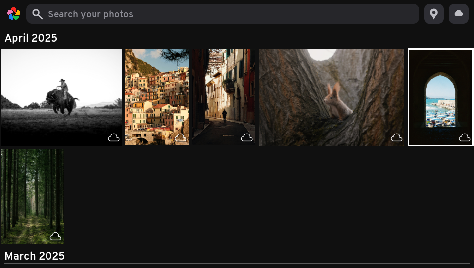
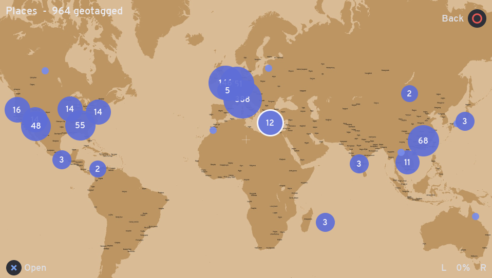
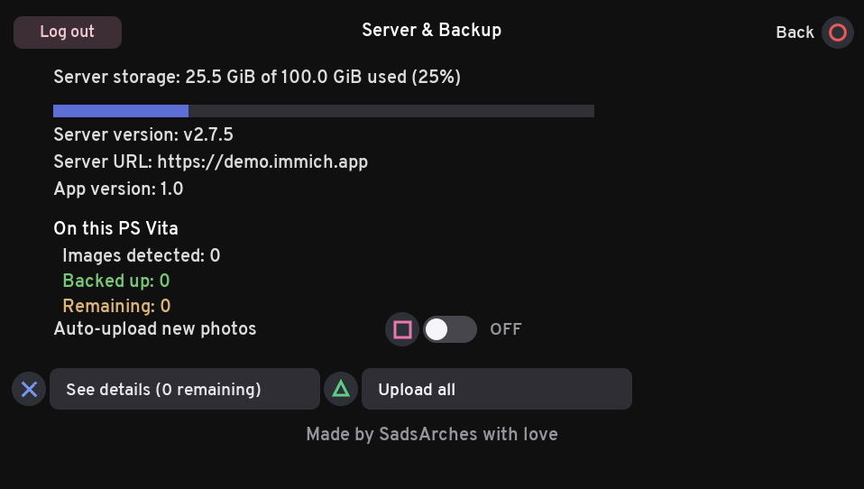

<div align="center">

# 📷 vitaImmich

### Your self-hosted photo library, in your hands.

A native **[Immich](https://immich.app/)** client for the **PlayStation Vita** —
browse, search and map your whole photo & video library over Wi‑Fi, play videos
on the Vita's hardware decoder, and back up the camera roll, all on a 12‑year‑old
handheld.

</div>

<table>
<tr>
<td width="33%"></td>
<td width="33%"></td>
<td width="33%"></td>
</tr>
<tr>
<td align="center"><b>Timeline &amp; search</b></td>
<td align="center"><b>Places map</b></td>
<td align="center"><b>Server &amp; backup</b></td>
</tr>
</table>

---

## ✨ Features

- 🗓️ **Timeline** — your entire library as a justified, date‑grouped grid (newest first), styled after the Immich web app.
- 🔍 **Smart search** — free‑text CLIP search straight from the Vita's keyboard.
- 🗺️ **Places map** — geotagged photos clustered on a world map; pan/zoom with the sticks and open any cluster as its own gallery.
- 🖼️ **Full‑screen viewer** — pinch/stick zoom & pan, swipe between photos, hardware‑accelerated **H.264 video** playback.
- ☁️ **Camera‑roll backup** — scans the Vita's photos & videos, dedupes against the server, and uploads on request.
- 📊 **Server overview** — storage usage, server/app versions, and per‑device backup status.
- 👆 **Touch + buttons** — the whole UI is drivable with the front touchscreen or the d‑pad/sticks.

> **Status:** proof‑of‑concept. App title id **`VIMM00001`**. See [limitations](#-limitations).

## 📦 Requirements

- A PS Vita running **HENkaku/h‑encore** with **VitaShell**.
- A reasonably recent **Immich server** reachable over the Vita's Wi‑Fi.
- An **Immich API key** (web UI → *Account Settings → API Keys*), an
  email/password, or **OAuth** (if your server has it enabled).

## 🚀 Install & configure

1. Grab `vitaImmich.vpk` from the [latest release](https://codeberg.org/SadsArches/vitaImmich/releases) (or build it — see below) and install it with **VitaShell**.
2. Launch it once; it creates `ux0:data/vitaimmich/config.txt`.
3. Edit that file (VitaShell's FTP, **SELECT**, makes this easy):

   ```ini
   server=http://192.168.1.100:2283
   apikey=your-immich-api-key
   ```

   Behind a reverse proxy without NAT loopback? Pin the domain to your LAN IP
   so the Host header / TLS SNI stay on the domain but the connection goes
   straight to the server:

   ```ini
   server=https://immich.example.com
   apikey=your-immich-api-key
   serverip=192.168.1.100
   ```

4. Relaunch. If `apikey`/`email`+`password` are left blank, the app drops to
   an interactive sign-in screen — pick **Log in with OAuth** there instead
   of typing credentials into `config.txt`.

### 🔐 Signing in with OAuth

OAuth is a **manual authorization-code** flow rather than a one-tap redirect —
you continue login on another device:

1. On the sign‑in screen, select **Log in with OAuth**. The app asks the
   server for your identity provider's authorization URL (standard
   authorization‑code + PKCE, via Immich's `/api/oauth/authorize` and
   `/api/oauth/callback`).
2. On *any* other device, either scan the on-screen QR code or open the
   wrapped address by hand, then sign in.
3. The provider redirects to a page that either fails to load or shows an
   "open in app?" prompt — either way, its address bar now has a `code=`
   value in it. Come back to the Vita, choose **Enter code / URL**, and type
   (or paste, if your device and the Vita can share a clipboard) either that
   code or the whole address.
4. The Vita exchanges it for a session and you're in. The session token is
   saved to `config.txt` (`token=`) so you don't have to repeat this on every
   launch — only when the session eventually expires or is revoked.

By default the redirect URI sent to your provider is the server's own
`/api/oauth/mobile-redirect` passthrough — the same one self-hosters
typically already allow for the official Immich mobile app, so this usually
needs no extra provider-side setup. If your provider rejects it, register
your own redirect URI and set it in `config.txt`:

```ini
oauth_redirect=https://your-registered-redirect/uri
```

## 🎮 Controls

**Timeline**

| Button | Action |
| --- | --- |
| D‑pad / sticks | Move selection (hold to repeat) |
| L / R | Jump a month up / down |
| △ | Smart search |
| X | Open full screen |
| 🗺️ / ☁️ (touch) | Open the Places map / server page |
| SELECT | Sync overview |
| START | Exit |

**Places map**

| Button | Action |
| --- | --- |
| Left stick / d‑pad / drag | Pan |
| Right stick / L · R | Zoom out / in |
| X | Open the centred cluster as a gallery |
| △ | Toggle the lat/lon graticule |
| O | Back |

**Full‑screen viewer**

| Button | Action |
| --- | --- |
| ← / → | Previous / next |
| Right stick / L · R | Zoom · left stick pans |
| X | Play video / retry a failed load |
| O | Back |

**Video playback** — X pause/resume · ←/→ seek ±10 s · O stop.

## 🔧 Building

Needs [VitaSDK](https://vitasdk.org/) with `libvita2d`, `curl`, `openssl`,
`zstd`, `zlib`, `libpng`, `libjpeg-turbo` and `freetype` (install via `vdpm`).

```sh
export VITASDK=$HOME/vitasdk
export PATH=$VITASDK/bin:$PATH
cmake -B build -S .
cmake --build build           # -> build/vitaImmich.vpk
```

The sources in `src/` are a **unity build**: `main.c` `#include`s the section
files (`state.c`, `draw.c`, … `app.c`) into one translation unit, so only
`main.c` is compiled. The geotag map's base tiles live in `assets/maptiles.pak`,
generated from a world‑map image by `tools/png_to_tiles.py`.

## ☁️ Camera‑roll backup

On startup the app mounts the Photos app's storage (`photo0:` /
`ux0:picture`) plus `ux0:video/CAMERA`, scans for `.jpg/.jpeg/.png/.mp4`, and
merges those files into the same date‑sorted timeline as your server library. A
badge in each cell's corner shows status:

- 🔵 blue‑grey dot — **cloud only**
- 🔶 orange up‑arrow — **local only**
- 🟠 blinking — **queued / uploading**
- 🟢 green check — **backed up** (on both; shown once, as the server asset)
- 🔴 red dot — **failed**

A background thread SHA‑1‑hashes each local file and asks the server which
already exist (`bulk-upload-check`). Uploads never start on their own — open the
sync overview (**SELECT**) and press **X** to queue every local‑only file.
Tunables in `config.txt`: `syncdir=<folder>` (repeatable) and `syncmaxmb=<MB>`
(size cap; files over 512 MB are skipped by default, 0 disables).

## ⚠️ Limitations

- **TLS verification is disabled** (no CA bundle ships) — prefer plain HTTP on a
  trusted LAN, or treat HTTPS as unverified.
- **OAuth sign-in is manual**: you complete the identity provider's login on
  another device (scan the QR code or open the address shown) and type the
  resulting code back in. If a saved OAuth session (`token=` in config.txt)
  is later revoked or expires, delete that line to drop back to the sign-in
  screen on next launch.
- Videos download in full to the memory card before playing (deleted after).
  Playback is the Vita's hardware decoder via SceAvPlayer, so only **MP4
  (H.264/AAC)** plays — Immich's transcoded `video/playback` stream is used.
- Backup is **one‑way** (Vita → server); `deviceId` is hard‑coded to "PS Vita"
  and uploads aren't added to an album.
- Thumbnails stream in one at a time on a background thread (grey placeholder
  until loaded); hashing the camera roll fills statuses in gradually.

---

<div align="center">
Made by <b>SadsArches</b> with love. ❤️
</div>
